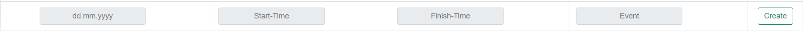
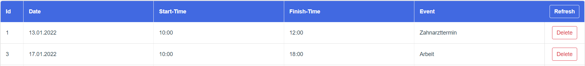

[](https://github.com/Eyad-Wahdan/PlanIt-Frontend/actions/workflows/ci.yml)

#PlanIt

Ein neues Semester hat begonnen und schon jetzt müssen der Großteil der Studierenden sich vielen Herausforderungen
stellen. Von großen Projektarbeiten hin zu kleineren Abgaben und den schon bald bevorstehenden Semesterklausuren.
Dabei die Übersicht zu verlieren, kann schon einmal schnell passieren.

Wir haben die Lösung für euch: PlanIt!

Ganz einfach und schmerzlos die Woche auf die Minute genau planen und strukturieren zu können, geht mit PlanIt.
Nur wenige Klicks genügen um neue Termine hinzuzufügen oder auch zu entfernen.

Probiere es aus!

## Project setup
```
npm install
```

### Compiles and hot-reloads for development
```
npm run serve
```

### Compiles and minifies for production
```
npm run build
```

### Run your unit tests
```
npm run test:unit
```

### Lints and fixes files
```
npm run lint
```

### Customize configuration
See [Configuration Reference](https://cli.vuejs.org/config/).

### Was kann PlanIt?

PlanIt kann Termine erstellen mit Benutzerdefinierten Events und Zeiträumen, als auch löschen.

### Wie benutzt man PlanIt?
Nachdem man PlanIt ausgeführt hat gelangt man auf die Homepage. Von da aus kann man auf "Let's get started" klicken und 
damit auf die "Calender"-Seite gelangen. Der Kalender ist eine tolle Übersicht von den ganzen Terminen, die der Nutzer 
erstellt hat. Von da aus kann man über die Taskleiste auf "Events" klicken. Da sieht man dann eine Tabelle mit den Events.
Außerdem kann man da dann neue Events erstellen oder auch andere Events löschen.

Um einen Termin zu erstellen muss man die freien Eingabefelder ausfüllen und danach auf "Create" klicken.


Um einen Termin zu löschen muss man einfach auf den "Delete"-Knopf klicken. Achtet auf die richtige Schreibweise in den Eingabefeldern!


